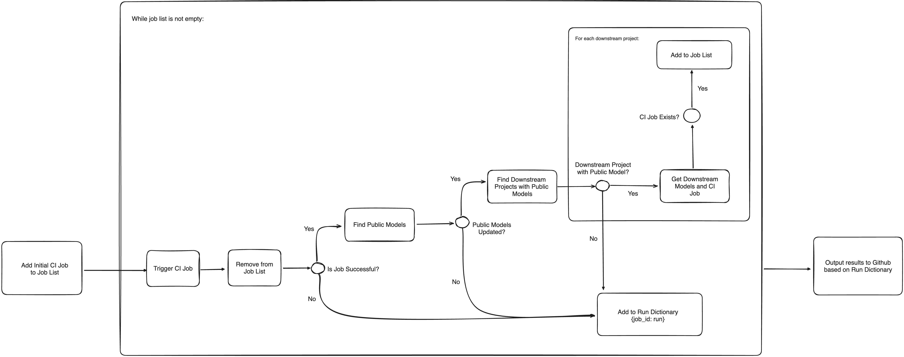
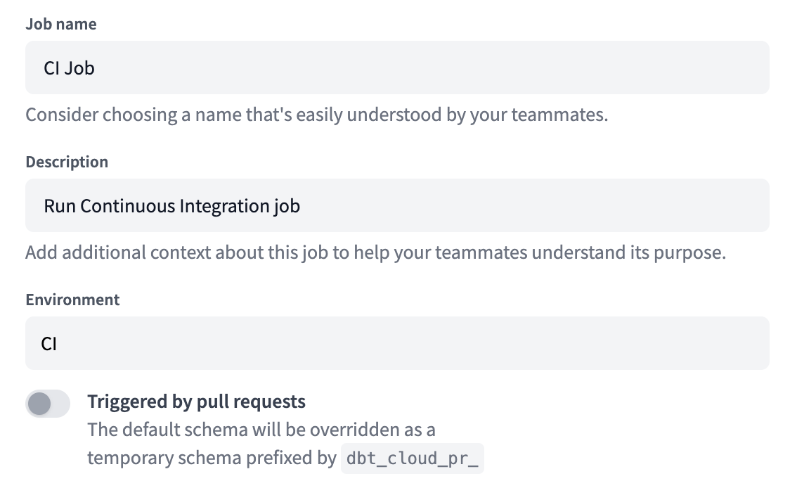

# Downstream CI

This is a Github action that is designed specifically for dbt Cloud customers who have implemented dbt Mesh.  The overarching idea here is that customers want to understand how downstream projects will be impacted by changes in upstream projects.  And, specifically, changes to public models that downstream projects have taken dependencies on.

## Process

The diagram below shows how this action is designed:



Additionally, the whole process is designed to be asynchronous so that downstream jobs will be triggered simultaneously when possible - but only triggered when their upstream counterpart completed successfully.

## Inputs

- `dbt_cloud_service_token`
- `dbt_cloud_account_id`
- `dbt_cloud_job_id` - This is the CI job to be used that's created within the project you place this action
- `dbt_cloud_host` - This is optional and should be used if your account is not in the North American multi-tenant instance
- `pull_request_id` - Use `${{ github.event.number }}`
- `git_sha` - Use `${{ github.event.pull_request.head.sha }}`
- `github_token` - Use `${{ secrets.GITHUB_TOKEN }}`

## Caveats

### Slim CI

This action assumes that you have set up a CI job within each of your projects in your account.  If a CI job isn't found, then nothing will be triggered for that downstream project.  Additionally, when you configure your Slim CI job, continue to follow the instructions [here](https://docs.getdbt.com/docs/deploy/ci-jobs#set-up-ci-jobs) but ensure that your CI job is **NOT** triggered by pull requests (switch the toggle off)



### `ref`

This whole process assumes that you have overridden the `ref` macro within each of the projects that you'd like for this process to work.  The macro below is what I have in each of my projects:

```sql








    



    





```

The important pieces are the `ref_schema_override` and `ref_database_override`.  When triggering the downstream CI jobs, we'll override the steps configured in the CI job to be:

1. Whatever models were found to be dependent on the upstream projects
2. The variable overrides for where we just built the upstream models

For example:

```
dbt build -s model_1+ model_2+ --vars '{ref_schema_override: dbt_cloud_pr_123456_5}'
```

Again, this just ensures that when we resolve the references in `model_1` and `model_2` (in the example above) that they're resolved to the schema and database where we just made changes to the upstream models they rely on.

## Example

```yaml
name: Downstream CI
on:
  pull_request:
    branches:
      - main
    types:
      - opened
      - reopened
      - synchronize
      - ready_for_review
jobs:
  trigger-dbt-job:
    runs-on: ubuntu-latest
    steps:
    - name: Checkout
      uses: actions/checkout@v2
    - name: dbt Cloud Downstream CI Action
      uses: dpguthrie/dbt-cloud-downstream-ci-action@0.2.0
      with:
        dbt_cloud_account_id: ${{ secrets.DBT_CLOUD_ACCOUNT_ID }}
        dbt_cloud_job_id: ${{ secrets.DBT_CLOUD_JOB_ID }}
        dbt_cloud_service_token: ${{ secrets.DBT_CLOUD_SERVICE_TOKEN }}
        dbt_cloud_host: 'cloud.getdbt.com'  # Optional
        pull_request_id: ${{ github.event.number }}
        git_sha: ${{ github.event.pull_request.head.sha }}
        github_token: ${{ secrets.GITHUB_TOKEN }}
```

## License

This project is licensed under the terms of the MIT license.
